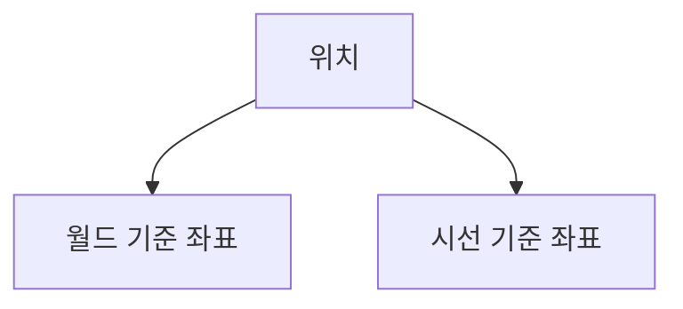

마인크래프트는 `x`, `y`, `z`, `ry`, `rx` 총 5축을 지원하는 게임입니다.  
모든 블록과 엔티티는 이 축 위에서 정의됩니다.

<br/>

# 위치(Position)
위치는 크게 2개로 구분할 수 있습니다.



## 월드 인수
마인크래프트는 좌표를 `+ 0.5` 더해서 인식합니다.
```mcfunction
# 0.5, 0.5, 0.5로 이동합니다.
tp 0 0 0


# 0.0, 0.0, 0.0으로 이동합니다.
tp 0.0 0.0 0.0
tp 0. 0 0.0
tp 0.0 0 0.


# 1.5, 0.0, 0.0으로 이동합니다.
tp 1 0 0.0
```

마인크래프트는 채팅을 제외한 [[:paper: 01-1 컨텍스트](#2/01-1)]에 아무런 값도 작성하지 않으면 `0.5, 0.0, 0.5`으로 인식합니다.
```mcfunction
# 무조건 명령 블록 혹은 함수에서 실행하십시오.
execute positioned    run tp @p ~  ~
execute positioned    run tp @p ~ ~ ~
```

<br/>

# 위치 기준 좌표
일반적인 위치를 나타내는 값으로, 월드를 기준으로 좌표를 지정합니다.

## 절대 좌표
월드 전체를 기준으로하여 절대 위치로 지정합니다.  
`int` 또는 `double` 값이 사용됩니다.

```mcfunction
# 정수 절대 좌표
setblock 1 0 3 minecraft:grass_block


# 소수점 절대 좌표
summon minecraft:armor_stand -1.0 0.0 -2.5
```


## 상대 좌표
현재 위치를 기준으로하여 상대 위치로 지정합니다.  
`int` 또는 `double` 값이 사용됩니다.

```mcfunction
# 정수 상대 좌표
execute positioned 2.0 0.0 -1.0 run setblock ~1 ~ ~3 minecraft:grass_block


# 소수점 상대 좌표
execute positioned 2.0 0.0 -1.0 run summon minecraft:armor_stand ~-2.0 ~ ~5.0
```


# 시선 기준 좌표
일반적인 위치를 나타내는 값으로, 시선을 기준으로 좌표를 지정합니다.

## 벡터 좌표
현재 시선을 기준으로 옆, 위/아래, 앞 위치를지정합니다.  
`int` 또는 `double` 값이 사용됩니다.

```mcfunction
# 정수 벡터 좌표
execute rotated 45 0 run setblock ^1 ^ ^1 minecraft:grass_block


# 소수점 벡터 좌표
execute rotated 45 0 run summon minecraft:armor_stand ^1.5 ^ ^2.5
```


---

<br/>

# 방향(Rotation)
일반적인 시선을 나타내는 값으로, 현재 [[:paper: 01-1 컨텍스트](#2/01-1)]를 기준으로 시선을 지정합니다.

## 방향 인수
마인크래프트는 시선을 값 그대로 인식합니다.
```mcfunction
# 0.0, 0.0을 바라봅니다.
rotate @s 0 0
rotate @s 0. 0
rotate @s 0.0 0.0


# 45.0, 0.0을 바라봅니다.
rotate @s 45 0
rotate @s 45.0 0.0
rotate @s 45 0.0
```

마인크래프트는 채팅을 제외한 [[:paper: 01-1 컨텍스트](#2/01-1)]에 아무런 값도 작성하지 않으면 `0.0, 0.0`으로 인식합니다.
```mcfunction
# 무조건 명령 블록 혹은 함수에서 실행하십시오.
execute rotated   run rotate @s ~ ~
execute rotated   run rotate @s  ~
```

<br/>

## 절대 좌표
상수 값을 가지고 절대 시선을 지정합니다.  
`float` 값이 사용됩니다.

```mcfunction
rotate @s 0 0


rotate @s 45 0
```


## 상대 좌표
상수 값을 가지고 상대 시선을 지정합니다.  
`float` 값이 사용됩니다.

```mcfunction
rotate @s ~45 0


rotate @s 0 ~45
```