마인크래프트는 `0.05`초마다 한 번 로직을 수행합니다.  
틱이 종료되면, 곧바로 다음 틱으로 넘어갑니다.

매 틱마다 마인크래프트는 여러 작업을 수행합니다.
- 플레이어나 엔티티의 공격을 처리합니다.
- 몹을 생성하고 몹의 AI를 처리합니다.
- 엔티티의 위치와 움직임을 업데이트합니다.
- 작물을 자라게 합니다.
- 불이 번지게 합니다.

`/tick` 명령어를 이용해 현재 틱을 직접적으로 건드리지 않았다면, 항상 `20.0`으로 고정합니다.

틱은 크게 다음 순서로 작업을 처리합니다.

```mermaid
sequenceDiagram
   autonumber

   %% 참가자들
   participant RS as runServer
   participant MS as MinecraftServer
   participant TC as tickChildren
   participant SL as ServerLevel
   participant LV as Levels
   participant EN as Entities
   participant SP as ServerPlayer

   %% 초기
   RS->>RS: 초기화
   RS->>MS: 틱 시작

   MS->>MS: 틱 수 증가
   MS->>TC: 모든 차원 순회

   %% tickChildren 내부 처리
   loop tickChildren 내부 처리
      TC->>TC: load.json 실행
      TC->>TC: tick.json 실행
      TC->>TC: 시간 동기화 (일출/일몰)
      TC->>TC: 네트워크 & GUI 업데이트
      TC->>TC: 패킷 처리
      TC->>TC: 플레이어 정보 업데이트
      TC->>TC: 청크 관련 패킷 전송
   end

   %% 각 차원 처리
   TC->>SL: 각 차원 처리

   par 월드 업데이트
      SL->>LV: 월드 보더 업데이트
      SL->>LV: 날씨 업데이트 (비/천둥/수면 비율)
      SL->>LV: 하늘 밝기 업데이트
   and 예약 작업
      SL->>LV: schedule 함수 예약
      SL->>LV: 블록 틱 예약
      SL->>LV: 유체 틱 예약
      SL->>LV: 습격 틱 예약
      SL->>LV: 청크 틱 예약 (언로드 등)
      SL->>LV: 블록 이벤트 예약
      SL->>LV: 블록 엔티티 예약
   and 엔티티 틱
      SL->>EN: 엔티티 틱 예약 (드래곤, 디스폰 등)
      EN->>SP: 발전과제 tick 조건
      SL->>EN: 인챈트 tick 조건
   end

   %% 다음 틱 예약
   MS->>RS: 다음 틱 예약
   RS-->>RS: 틱 종료
```

---

 

# 데이터 팩
데이터 팩은 크게 다음 순서로 작업을 처리합니다.

## 참고
### 명령 블록
- 먼저 실행한 명령 블록을 기준으로 실행됩니다.
- 동시 실행 시, `반복형 항상 활성화`는
   `일반 레드스톤 필요 명령 블록`보다 나중에 실행됩니다.

### tick 발전과제
- 틱을 멈춰도 작동합니다.

### tick 인챈트
- 틱을 멈추면 작동하지 않습니다.
- 무언가에 탑승하고 있다면, 발전과제보다 먼저 실행됩니다.

---

 

자세한 내용은 [[:github: tick_order](https://gist.github.com/misode/77ee37217a69a3c74032679d8084d6c6)]를 참고하십시오.